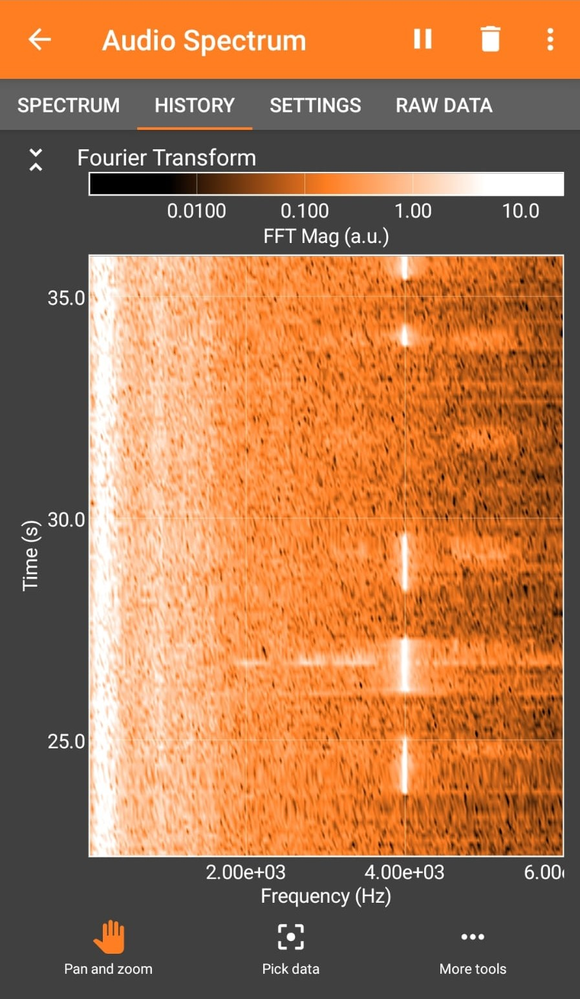

# TestApp

This was a parody PoC app made to secretly transmit data.
- Based on the fact that humans cannot hear higher frequencies when they get older
- Select a frequency only you can hear and you can transmit yourself any message you want secretly*
- *Might also be useful in case of a zombie apocalypse if they can't hear higher frequencies **(who knows)***

## Audio Spectrum 
- For selected configuration with transmit_freq as 19990 Hz and a time_step of 0.4 seconds i was able to make out the code clearly
- Spectrum Files attached 
 

## Warning
- Selecting Extreme Frequencies might cause headaches and/or auditory distress
- DO NOT USE IT TO CHEAT IN EXAMS. I AM NOT RESPONSIBLE IF YOU GET CAUGHT.
