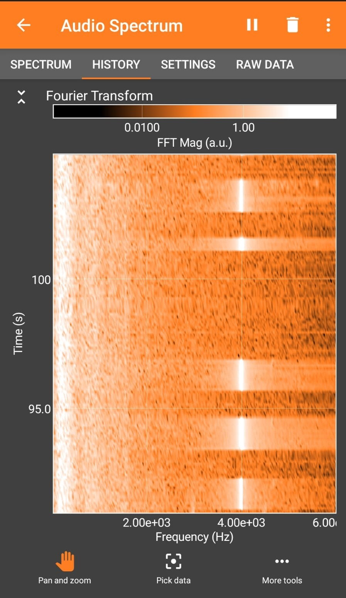

# TestApp

This was a parody PoC app made to secretly transmit data in such a way that people of only a certain age group can hear the secret message being transmitted. 

- Based on the fact that humans cannot hear higher frequencies when they get older.
- We first select a frequency that we can barely hear - to ensure that people older than us can hardly hear it.
- Take a string. Convert it to Morse code that can be transmitted. Transmit it as a sine wave of that frequency.
- Select a frequency only you can hear and you can transmit yourself any message you want secretly*
- *Might also be useful in case of a zombie apocalypse if they can't hear higher frequencies **(who knows)***

The secret message can be heard by anyone who has an age lower than that - **Ideally**

The message can be decoded to text by anyone with the knowledge what it is.

## Audio Spectrum 
- For selected configuration with transmit_freq as 19990 Hz and a time_step of 0.4 seconds i was able to make out the code clearly
- Spectrum Files attached 
 

## Warning
- Selecting Extreme Frequencies might cause headaches and/or auditory distress
- DO NOT USE IT TO CHEAT IN EXAMS. I AM NOT RESPONSIBLE IF YOU GET CAUGHT.
